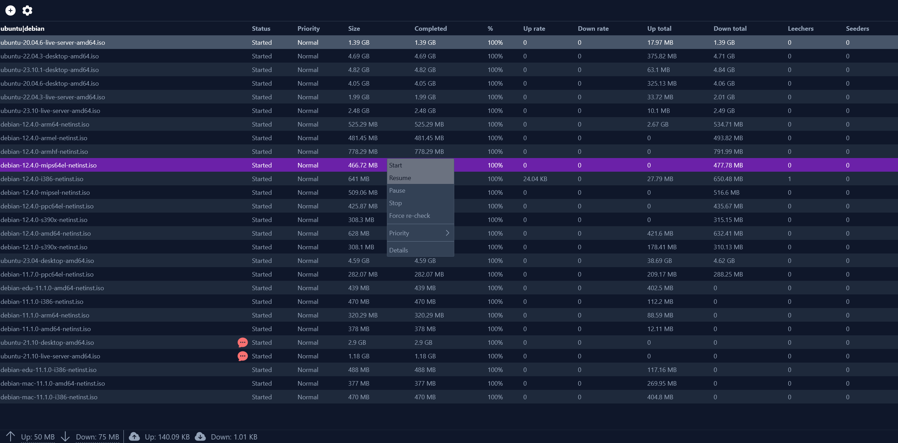
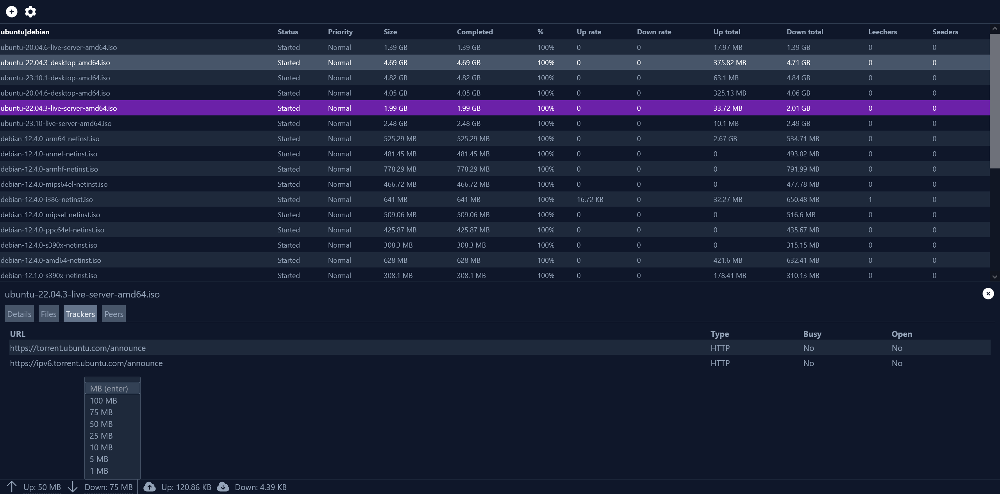

# kahva

XML-RPC/JSON API and web client for rTorrent.

The backend is used to deserialize XML-RPC requests from rTorrent to more browser friendly JSON presentation. It also serves the [optional Vue frontend](https://github.com/salimnassim/kahva-web), a dedicated HTTP server is not required.

---

## Features

- [x] List view torrents 
- [x] List torrent files, trackers, peers
- [x] Load torrent
- [x] Manage torrent state
- [x] Manage global throttle
- [ ] Manage torrent labels
- [ ] Manage rTorrent settings

## Screenshots




## Configuration

### Environment variables

#### Backend
- `SERVER_ADDRESS` HTTP server bind address, it is `0.0.0.0:8080` by default. 
- `XMLRPC_URL` Remote XML-RPC server URL, this will be the URL exposed by your nginx (or similar) web server (e.g. `https://yourdomain.tld/rpc`)
- `XMLRPC_USERNAME` Optional basic authentication username
- `XMLRPC_PASSWORD` Optional basic authentication password
- `CORS_ORIGIN` CORS origin if the frontend runs on a different path
- `CORS_AGE` CORS age if the frontend runs on a different path

#### Frontend

- `VITE_BACKEND_BASE_URL` backend address. It will be `http://localhost:8080` most likely and NOT set by default. This variable is build time only.

### Remote server setup

#### rTorrent

rTorrent should be configured to expose the XML-RPC interface through a UNIX socket.This can be achieved by adding the following lines to your `.rtorrent.rc` file. A regular SCGI socket should _never_ be used unless you are for certain that it cannot be accessed from outside your network.

```
...
scgi_local = /path/to/some/directory/xmlrpc.socket
schedule = scgi_permission,0,0,"execute.nothrow=chmod,\"g+w,o=\",/path/to/some/directory/xmlrpc.socket"
...
```

**Make sure that the socket is writable by the user that runs nginx (e.g. www-data)**


If you have an excessive amount of metadata you might need to increase the default XML-RPC limit. This is almost never required.

```
network.xmlrpc.size_limit.set = 10M
```

#### nginx

Create a nginx virtual host that serves the XML-RPC socket. Basic authentication is optional but recommended (read: a must) if you are accessing the server remotely. Note that the XML-RPC interface can be used to execute shell commands remotely.

You can use the snippet below as an example.

```
server {
        root /usr/share/nginx/html;
        index index.html;
        server_name yourdomain.tld;

        server_tokens off;
        autoindex off;
        auth_basic_user_file /path/to/some/directory/.htpasswd;
        auth_basic "super secret";

        location /rpc {
                include    scgi_params;
                scgi_pass  unix:/path/to/some/directory/xmlrpc.socket;
        }
}
```

A configuration like this will serve the socket at `http://yourdomain.tld/rpc`.

### Building

Easiest way to run the application is with Docker. The server will bind to `0.0.0.0` and use port `8080` by default. 

Build and run the image using `docker compose up --build`. Remember to change the environment variables to match your server configuration.

Alternatively the frontend and backend can be compiled separately.

#### Backend

Install the Go compiler and run `go build -v -o ./kahva ./cmd`. This should result in a single `kahva` binary.

#### Frontend

Clone [the frontend repository](https://github.com/salimnassim/kahva-web)

Install Node and the required dependencies. Run `VITE_BACKEND_BASE_URL=http://localhost:8080 npm run build`. This should result in a `dist/` directory.

Finally move the dist directory on the same level as the backend executable and rename the folder to `www/`.

The directory structure should look rougly like this:

```
./kahva
./www/
     /index.html
     /assets/
     /assets/...
```

Run the binary with `SERVER_ADDRESS=0.0.0.0:8080 OTHER_ENV_VARAIBLES=... ./kahva`

#### Running

The backend can be used as a standalone application to manage rTorrent. Some examples below.

##### List unregisted torrents
```
curl localhost:8080/api/view/main | jq -r '.torrents[] | select(.message | ascii_downcase | contains("unregistered torrent")) | .hash'
```

### Routes

All API routes are prefixed with `/api`

#####  List all torrents in view (default view is `main`)

`GET /api/view/{view}`

##### Show system details (global throttle/rate, versions etc.)

`GET /api/system`

##### Load torrent

`GET /api/load`

the form body should contain a `file` key which holds the file.

##### List files/peers/trackers

`GET /api/torrent/{hash}/{files,trackers,peers}`

##### Set torrent state or force hash re-check

`GET /api/torrent/{hash}/{start,resume,stop,pause,hash}`

##### Set torrent priority

`POST /api/torrent/{hash}/priority`

the JSON body should contain a key `priority` which is an integer between `0` and `3`

##### Set global throttle

`POST /api/throttle`

the JSON body should contain a key `type` which is `up` or `down` and key `kilobytes` as an integer which represents the throttle limit.

### Default fields

The backend implements a subset of fields by default. In order to add more fields add them to the correct struct in `rtorrent.go`. The field should contain the corresponding tag for deserialization. 

## Problems?

Check the backend stdout for clues and always verify that your environment variables are correct and point to the right place.

If the server is reporting deserialization issues check the nginx error log and enable XML-RPC logging  in `.rtorrent.rc` by adding the line `log.xmlrpc = "/path/to/somewhere/xmlrpc.log"`.

If you are still experiencing issues and you are absolutely sure that the problem is not with your server and/or configuration, create an issue in this repository.